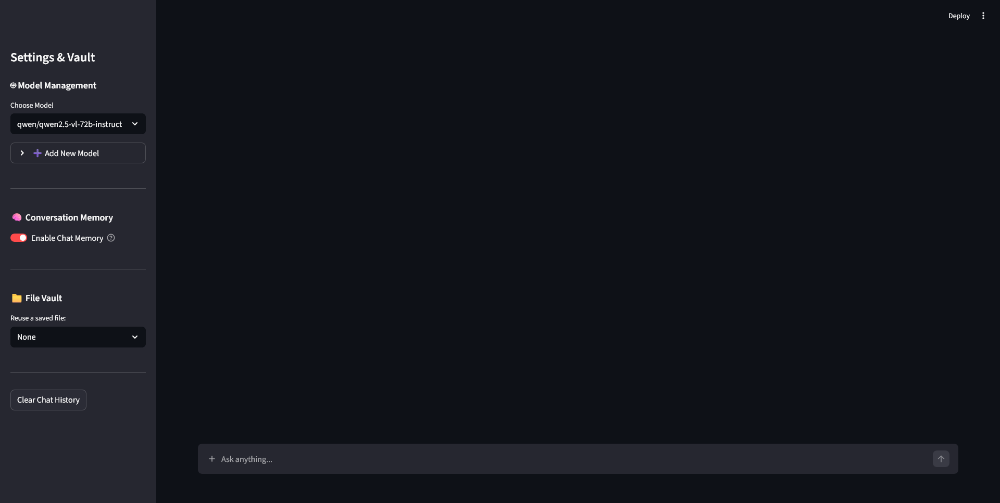

# 📁 RyChat OpenRouter: AI Chat Interface (Using Your Own API Key)

**OpenRouter Pro** is a powerful, localized AI chat application. It combines the flexibility of the OpenRouter API with a persistent SQLite backend and a sophisticated file management system.

## Preview


## 🚀 Key Features

* **🧠 Intelligent Memory Toggle:** Choose whether the AI "remembers" the current conversation.
* **ON:** Sends full chat history for seamless conversation.
* **OFF:** Sends only the current prompt (saving tokens and focusing on a specific task).


* **🤖 Dynamic Model Manager:** Add and save any OpenRouter model ID (e.g., `meta-llama/llama-3-70b-instruct`) directly from the UI.
* **📁 Permanent File Vault:** Upload files once to the `uploaded_files/` directory and reuse them in future chats without re-uploading.
* **💾 SQLite Persistence:** All chat logs, model lists, and file paths are stored in a local `chat_history.db` for complete auditability.
* **📎 Smart File Handling:** Detects new uploads vs. vault selections and automatically injects file content into the AI's context.
* **🔄️ Token Counter:** Counts and stores used tokens into db.

---

## 🛠️ Installation & Setup

### 1. Requirements

Ensure you have Python 3.8+ and install the necessary libraries:

```bash
pip install streamlit openai python-dotenv

```

### 2. API Configuration

Create a `.env` file in the root directory:

```text
OPENROUTER_API_KEY=your_key_here

```

### 3. Run the App

```bash
streamlit run app.py

```

---

## 📖 How to Use

### 1. Managing Models

Use the **"Model Management"** section in the sidebar. You can select from your existing list or add a new OpenRouter model ID via the expander. These are saved to the database instantly.

### 2. Using Memory

Toggle the **"Enable Chat Memory"** switch.

* Turn it **Off** if you want to perform a "Single-shot" task where previous conversation context might interfere or waste tokens.
* Turn it **On** for standard back-and-forth chatting.

### 3. Handling Files

* **New Uploads:** Use the paperclip icon in the chat input. The file is saved to your disk and the text is sent to the AI.
* **File Vault:** To reuse a file, select it from the dropdown in the sidebar. It will be "attached" to your next sent message.

---

## 🏗️ Technical Architecture

* **Frontend:** Streamlit
* **API:** OpenAI Python Client (configured for OpenRouter)
* **Database:** SQLite3
* **Storage:** Local filesystem (`/uploaded_files`)

---

## 🔒 Security

* **API Keys:** Loaded via `python-dotenv` to keep your credentials out of the source code.
* **Local Storage:** Your chat data and files never leave your machine except for the specific text sent to the OpenRouter API.
